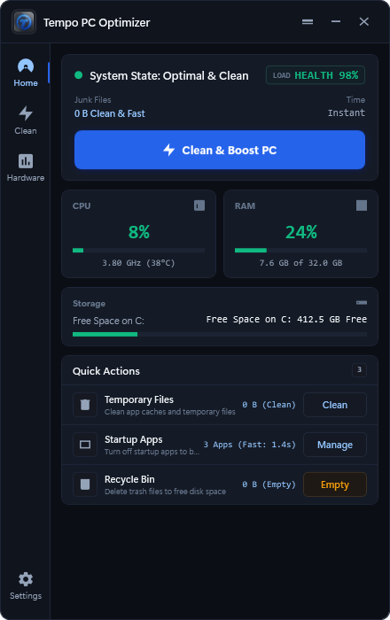
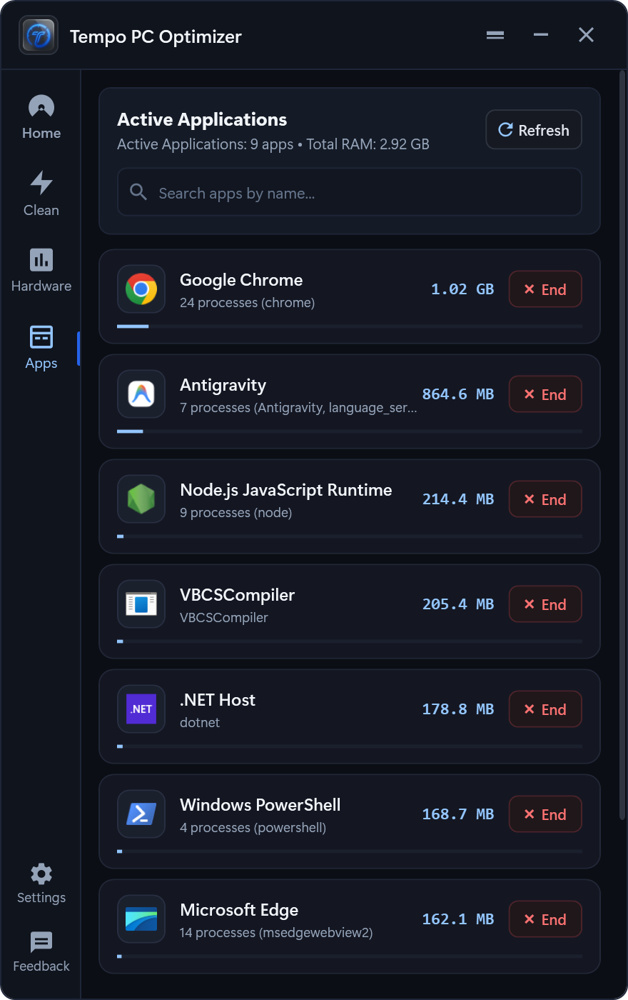
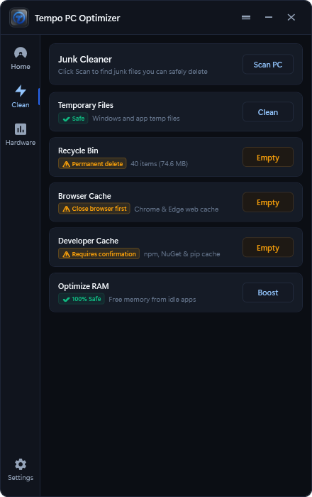
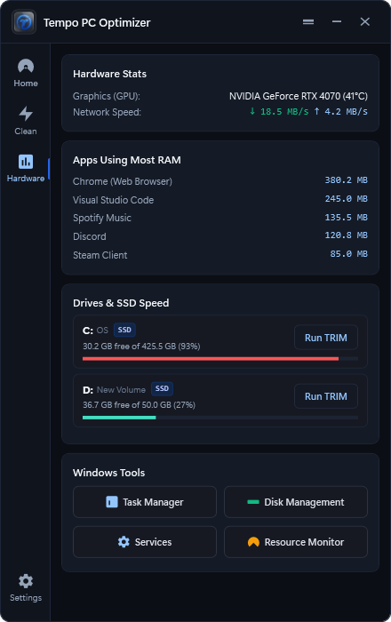
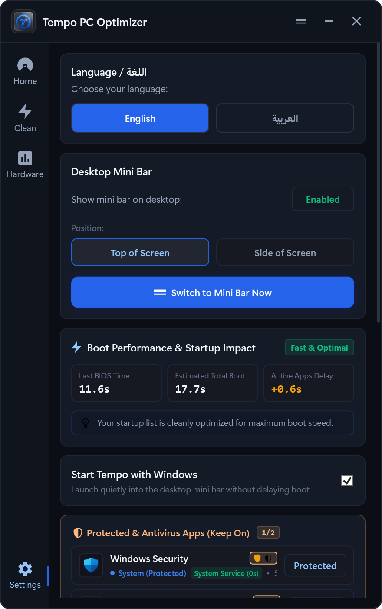
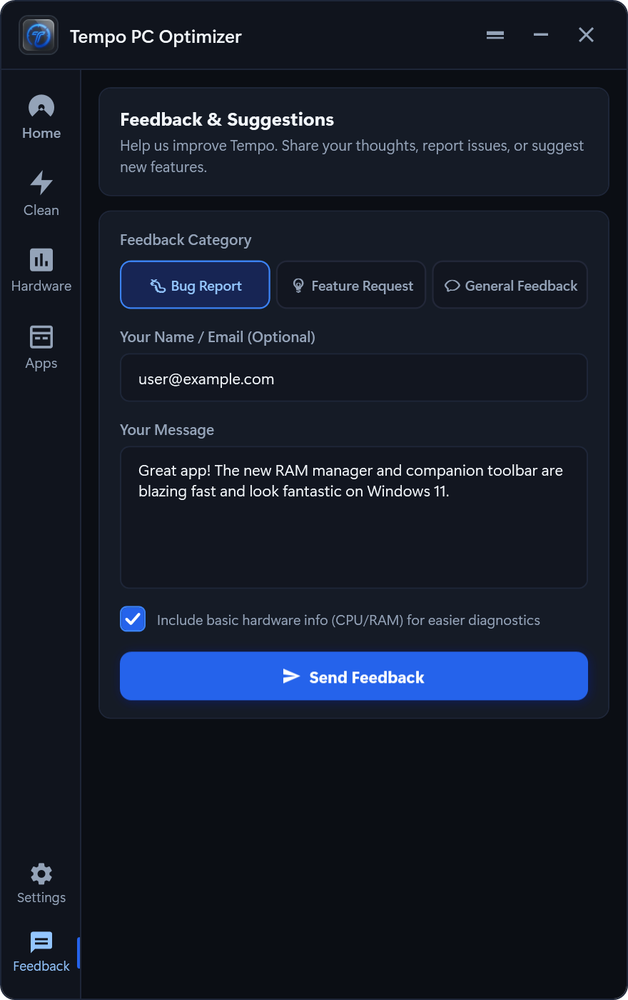

<div align="center">

  

  # Tempo PC Optimizer
  **High-Precision Windows Diagnostic, Telemetry & Performance Engine**

  *أداة هندسية خفيفة وعالية الدقة لتشخيص وتحسين أداء ويندوز 10 و 11*

  <br />

  [-2563EB.svg?style=for-the-badge&logo=windows)](https://github.com/Abdelrahman-Tamer/Tempo-PC-Optimizer/releases/latest)
  [](https://github.com/Abdelrahman-Tamer/Tempo-PC-Optimizer)
  [](https://github.com/Abdelrahman-Tamer/Tempo-PC-Optimizer)
  [](https://dotnet.microsoft.com/)
  [](LICENSE)

  <br />

  [**🌐 Official Website & Download Page**](https://abdelrahman-tamer.github.io/Tempo-PC-Optimizer/) • [**📦 Download Setup (.exe)**](https://github.com/Abdelrahman-Tamer/Tempo-PC-Optimizer/releases/download/v2.2.4/Tempo-Setup-v2.2.4.exe) • [**🪶 Portable (.zip)**](https://github.com/Abdelrahman-Tamer/Tempo-PC-Optimizer/releases/download/v2.2.4/Tempo-v2.2.4-win-x64.zip) • [**🐛 Report an Issue**](https://github.com/Abdelrahman-Tamer/Tempo-PC-Optimizer/issues)

</div>

---

## 📸 Visual Showcase / معرض شاشات التطبيق

<div align="center">
  <table>
    <tr>
      <td width="50%" align="center">
        <b>📊 Diagnostic Dashboard</b><br /><br />
        
      </td>
      <td width="50%" align="center">
        <b>🚀 Active Apps &amp; RAM Manager</b><br /><br />
        
      </td>
    </tr>
    <tr>
      <td width="50%" align="center">
        <b>🧹 Clean &amp; Optimize Modules</b><br /><br />
        
      </td>
      <td width="50%" align="center">
        <b>💽 Hardware Diagnostics &amp; SSD TRIM</b><br /><br />
        
      </td>
    </tr>
    <tr>
      <td width="50%" align="center">
        <b>⚙️ Startup Manager &amp; Settings</b><br /><br />
        
      </td>
      <td width="50%" align="center">
        <b>💬 User Feedback &amp; Suggestions</b><br /><br />
        
      </td>
    </tr>
    <tr>
      <td colspan="2" align="center">
        <b>📌 Dual-Mode Companion Mini Bar (Top Capsule &amp; Side Dock)</b><br /><br />
        
      </td>
    </tr>
  </table>
</div>

---

## ⚡ Key Highlights / بالمختصر المفيد

- **📊 100% Honest Telemetry**: Live hardware metrics (CPU clock, RAM usage, GPU stats, Network I/O) polled directly via Windows Win32 APIs and LibreHardwareMonitor — zero fabricated or simulated numbers.
- **🚀 Active Applications & RAM Manager**: Clean view of active desktop apps with intelligent child-process rollup (bundles helper workers into parent apps), 4-second auto-refresh, and one-click task termination.
- **🛡️ Hardened Filesystem Safety**: Hierarchical boundary enforcement (`IsSafePath`), automatic skipping of NTFS junctions/symlinks, and a strict 24-hour age cutoff protect personal files from accidental deletion.
- **🚀 Sub-150ms Turbo RAM Boost**: Immediately flushes inactive application working sets while strictly protecting 15 core Windows NT kernel services (`System`, `dwm`, `explorer`, `svchost`, `MsMpEng`, etc.).
- **📌 Fluid Companion Mini Bar**: Floating desktop bar (42px top capsule / 34px slim side dock) with live telemetry and smooth in-bar hardware-accelerated motions — zero toast banner spam.
- **💬 Direct Feedback Channel**: Built-in feedback form in both the desktop app and website for reporting bugs and requesting features with optional system diagnostics.
- **💽 Drives & Elevated SSD TRIM**: Accurately detects storage media types (SSD vs HDD) and issues elevated TRIM commands safely.
- **🌐 Dual LTR / RTL Architecture**: Instant switching between English (LTR) and standard Arabic (RTL) without restart, with auto-sizing buttons and zero text clipping.

---

## 📥 Download & Verification / التحميل والتحقق

| Package | Type | Version | Arch | Size | Direct Download |
| :--- | :---: | :---: | :---: | :---: | :--- |
| **Tempo-Setup-v2.2.4.exe** | 🚀 **Installer** *(Recommended)* | `2.2.4` | `x64` | **4.46 MB** | [**Download Setup (.exe)**](https://github.com/Abdelrahman-Tamer/Tempo-PC-Optimizer/releases/download/v2.2.4/Tempo-Setup-v2.2.4.exe) |
| **Tempo-v2.2.4-win-x64.zip** | 🪶 **Portable** | `2.2.4` | `x64` | **5.20 MB** | [**Download Portable (.zip)**](https://github.com/Abdelrahman-Tamer/Tempo-PC-Optimizer/releases/download/v2.2.4/Tempo-v2.2.4-win-x64.zip) |

### Cryptographic Integrity (SHA256)

Verify downloaded binaries before execution via PowerShell:

```powershell
Get-FileHash .\Tempo-Setup-v2.2.4.exe -Algorithm SHA256
```

| File | Expected SHA256 Checksum |
| :--- | :--- |
| `Tempo-Setup-v2.2.4.exe` | `5192abefec48f58e36e5e02c3d34216e7728f015ba65fe7c912e9c5922a7c6a4` |
| `Tempo-v2.2.4-win-x64.zip` | `60f04fd290b337ecdf17a5c4f2f5b104aaaddd19764a2189a9a53c3a0c2e75b7` |

---

## 💻 System Requirements / متطلبات التشغيل

- **Operating System**: Windows 10 (Version 1703+) or Windows 11 (64-bit).
- **Architecture**: `x64` Native.
- **Runtime**: [.NET 10.0 Desktop Runtime](https://dotnet.microsoft.com/download/dotnet/10.0) (verified automatically during setup).
- **Privilege Level**: Runs as standard user (`asInvoker`). Administrator elevation is requested on-demand only for SSD TRIM and updates.

---

## 🛠️ Build from Source / البناء البرمجي

```powershell
# Clone repository
git clone https://github.com/Abdelrahman-Tamer/Tempo-PC-Optimizer.git
cd Tempo-PC-Optimizer

# Restore dependencies
dotnet restore

# Build release binary
dotnet build -c Release

# Publish lean win-x64 binary
dotnet publish Tempo.csproj -c Release -r win-x64 --self-contained false -o publish_tempo
```

---

## 🛡️ Security & Anti-Virus Compatibility

> Tempo is open-source, runs as standard user (`asInvoker`), collects **no telemetry or PII**, and never phones home. Some anti-virus engines may flag certain Windows APIs used for legitimate system optimisation. This section documents each sensitive API and the safeguards applied.
>
> Tempo مفتوح المصدر ويعمل بصلاحيات المستخدم العادي. لا يجمع بيانات شخصية ولا يرسل أي معلومات تلقائياً. بعض محركات مكافحة الفيروسات قد تنبه على واجهات Windows المستخدمة في التحسين المشروع — التفاصيل أدناه.

### APIs & Safeguards

| API / Behaviour | Purpose | Safeguards |
| :--- | :--- | :--- |
| `EmptyWorkingSet` (psapi.dll) | Flushes inactive process working sets to free physical RAM | 37 Windows system processes excluded (svchost, csrss, lsass, dwm …), foreground window skipped, >40 MB threshold, max 10 processes per cycle |
| Native Self-Elevation (`--set-approved`, `--measure-boot`, `--trim`) | Elevated operations dispatched via own executable (`runas`) | **Zero external scripting** — PowerShell completely retired. Direct child process handlers with strict parameter validation, Base64 encoding, and process tree watchdogs |
| `HKCU\…\Run` write | "Start with Windows" checkbox | User-initiated only, HKCU scope (no admin), deleted on uncheck |
| `HKLM\StartupApproved` toggle | Enable/disable existing startup apps | Task Manager feature parity — toggles existing entries only, never creates new ones; system-managed entries (0x06) rejected; HKLM write requires UAC consent |
| `Process.Kill()` | Timeout watchdogs + user-initiated end-task | Child-process-only for cleanup timeouts (5–30 s); user end-task guarded by 58 protected process names |
| Update installer launch (`runas`) | Applies downloaded update | 5-gate chain: HTTPS-only → `.exe`-only → mandatory SHA256 from GitHub release → random temp filename → post-download `CryptographicOperations.FixedTimeEquals` verify |
| `AllowUnsafeBlocks: false` | Safe memory queries | Completely disabled across solution; 100% managed safe C# with zero unsafe blocks |

### Code Signing Status

> **⚠️ Current builds are unsigned.** Windows SmartScreen may display a "Windows protected your PC" warning on first run. This is expected for open-source software without an Extended Validation (EV) code-signing certificate. See [`docs/SIGNING.md`](docs/SIGNING.md) for the signing roadmap.

### VirusTotal

After each release, a VirusTotal scan link will be published in the [GitHub Release notes](https://github.com/Abdelrahman-Tamer/Tempo-PC-Optimizer/releases/latest).

### Privacy

- **No telemetry, no analytics, no tracking.**
- **No automatic data collection** — the optional feedback form is the only outbound request and requires explicit user action.
- Hardware diagnostic data (CPU %, RAM %) is attached to feedback **only** when the user opts in via a visible checkbox.

---

## 📝 Diagnostic Logs & Troubleshooting / سجلات التشخيص

Tempo maintains structured, rotated diagnostic logs under `%AppData%\Tempo\` (capped at 5 MB each with automatic `.old` rotation):

| Log File | Component | Description |
| :--- | :--- | :--- |
| `%AppData%\Tempo\error.log` | **App & UI Lifecycle** | Captures unhandled UI exceptions, domain errors, window positioning and feedback submission errors. |
| `%AppData%\Tempo\hardware.log` | **Hardware & Telemetry** | Logs LibreHardwareMonitor sensor states, CPU/GPU query notices, WMI lookups, and startup registry events. |
| `%AppData%\Tempo\logs\app.log` | **Cleanup & Optimization** | Detailed audit of temp cleaning runs, process working-set trims, and filesystem operation metrics. |

---

## 👨‍💻 Author & License

- **Architect & Developer**: **Eng. Abdelrahman Emam** ([@Abdelrahman-Tamer](https://github.com/Abdelrahman-Tamer))
- **Copyright**: © 2026 Eng. Abdelrahman Emam. All rights reserved.
- **License**: Released under the [MIT License](LICENSE).